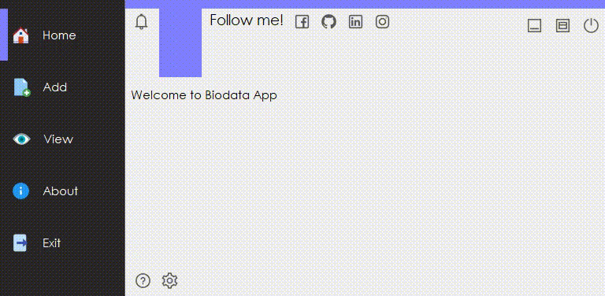

# Biodata App
🎆 A flat design Biodata App that build with C# and made with ❤️ by Oende.

## Getting Started
First you need to download the source code and extract it to a spesifc folder, then open it with Microsoft Visual Studio 2017 (Recommended). And you can rebuild and run the project.

Just in case you only need the **.exe** file, you can absolutely find it in 
***AppBiodata > bin > Debug > AppBiodata.exe***
### Database
This app using MySQL as the database. Make sure you already have it and run the service.
You can find the dump sql file in the root folder and simply restore it.

## Demo

There is a lot of unavailable feature or bugs or any other little things again, but I hope we can update it really soon!

## Contributing
We are always open with any PR.
Your feedback is always welcome.

## License
This project is licensed under the Apache License. See [LICENSE](https://github.com/Oende/biodata-app/blob/master/LICENSE "LICENSE") file for more information.